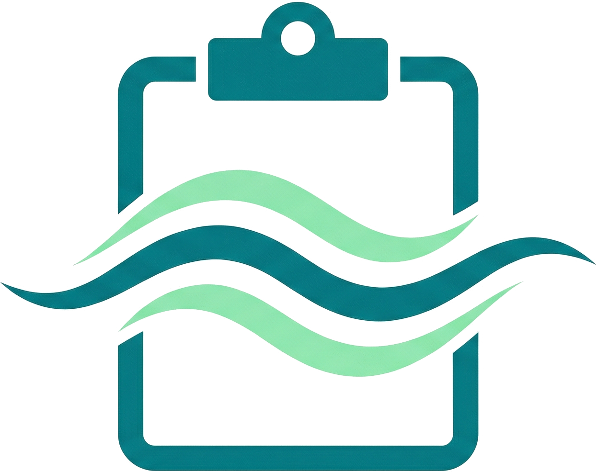

<p align="center">
  
</p>

<h1 align="center">Clipboard River</h1>

<p align="center">
  <a href="README.md">English</a> | <a href="README.zh-CN.md">简体中文</a>
</p>

<p align="center">
  一个强调快捷、低打扰、尽量无感的跨设备剪切板同步项目。
</p>

## 它真正想做到什么

Clipboard River 的核心目标很简单：

让剪切板同步这件事尽量“感觉不到它存在”。

当两端都是 Windows，并且都在线时，理想体验就是：

1. 这边 `Ctrl + C`
2. 切到另一台设备
3. 直接 `Ctrl + V`

不需要手动刷新，不需要点发送，不需要先开某个同步面板。

这就是这个项目最核心的价值。

## 为什么是它

- 快：实时同步，延迟尽量低
- 无感：目标就是像共享了一个剪切板一样自然
- 实用：支持文本，也支持单文件同步
- 可控：自建服务端，可查看历史、管理设备、控制接入
- 跨平台：当前 Windows 体验最好，Android 已可用，iOS 会在后续版本推出

## 平台现状

### Windows

目前体验最好的就是 Windows。

当两端都是 Windows 客户端时，Clipboard River 可以非常接近“原生共享剪切板”的感觉，也就是一端复制，另一端直接粘贴。

### Android

Android 端已经支持，但由于 Android 对剪切板访问和后台行为本身限制更多，体验会比 Windows 稍微麻烦一点。

它依然能用，而且是实用的，但不会像 Windows 双端那样几乎无感。

### iOS

iOS 会在后续版本推出。

如果你想更早接入，也可以直接根据 [ApiRef.md](./ApiRef.md) 自行开发客户端。

## 当前限制

- 当前最接近“无感同步”的体验，仍然是两端都在线的 Windows 到 Windows。
- 在 Windows 端，本地文件复制捕获目前只会在“恰好复制了 1 个文件”时触发。
- 暂不支持多文件复制和文件夹复制。
- 当前非文本内容统一走单文件上传链路；`mime_type` 以 `image/` 开头的文件会在后台提供预览。
- 暂不支持富文本、HTML 片段、复杂 Office 剪切板内容这类格式。
- Android 已可用，但受平台限制影响，体验不会像 Windows 双端那样几乎无感。

## 当前仓库是什么

当前仓库只包含服务端，负责：

- 设备注册
- 实时消息分发
- 剪切板历史存储
- 文件 blob 存储
- 管理后台
- Docker 部署支持

协议和接口细节统一写在 [ApiRef.md](./ApiRef.md) 里。README 不再展开内部字段和实现细节，避免首页变成接口说明书。

## 仓库入口

- 服务端：`cb_river_server`（当前仓库）
- Windows 客户端：[cb_river_client_windows](https://github.com/CoronaAustralis/ClipboardRiverWindowsClient)
- Android 客户端：[cb_river_client_android](https://github.com/CoronaAustralis/ClipboardRiverAndroidClient)
- 接口文档：[ApiRef.md](./ApiRef.md)

上面的客户端仓库链接是按当前工作区里的项目命名推导出来的。如果你后续发布时使用了不同的组织名或仓库名，把这里替换掉即可。

## 快速开始

1. 启动服务端：

```powershell
powershell -ExecutionPolicy Bypass -File .\scripts\go-local.ps1 run ./cmd/cb-river-server
```

2. 如果 `config.json` 不存在，服务端会自动生成一份初始配置。若想改路径，设置 `CBR_CONFIG` 即可。
3. 第一次启动时，如果数据库里还没有管理员账号，服务端会自动生成一个 10 位随机密码，把哈希写进数据库，并只在日志里打印一次明文。
4. 打开 [http://127.0.0.1:8080/admin/login](http://127.0.0.1:8080/admin/login)。
5. 进入后台生成接入码，然后让客户端注册。

`config.example.json` 只是示例配置，运行时默认读取的是 `./config.json`。

## Docker

```
docker run --name clipboard-river-server -p 8080:8080 -v ${PWD}\data:/app/data crestfallmax/clipboard-river-server
```

- 容器内配置路径：`/app/data/config.json`
- 配置、SQLite 数据库和 blob 文件都放在 `/app/data`
- 首次生成的管理员密码会打印到容器日志中

## 文档与工具

- 接口文档：[ApiRef.md](./ApiRef.md)
- 示例配置：[config.example.json](./config.example.json)
- 清空剪切板历史和 blob 文件：`./scripts/clear-history.ps1`
- 运行测试：`./scripts/go-local.ps1 test ./...`
